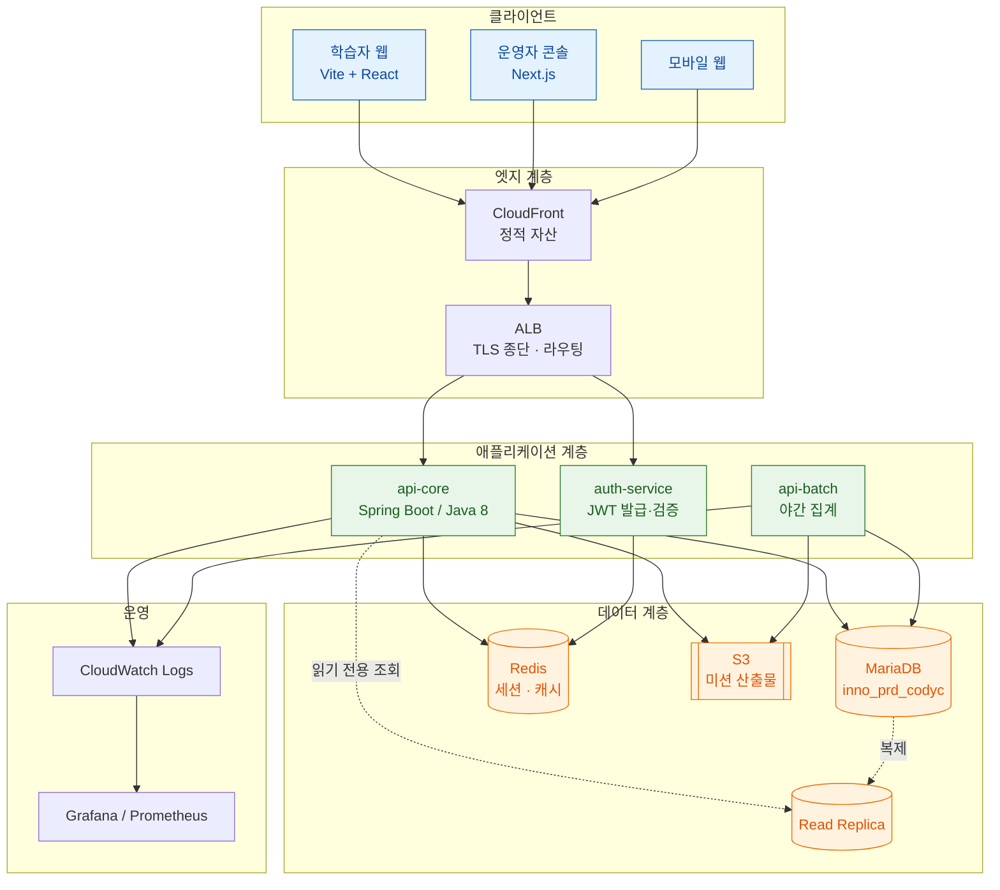
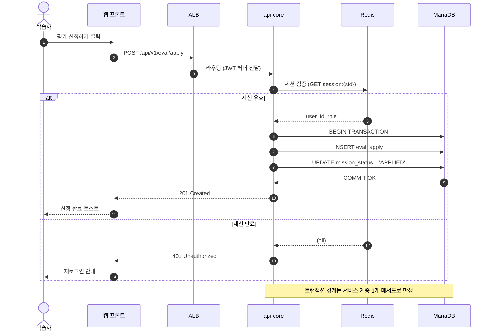
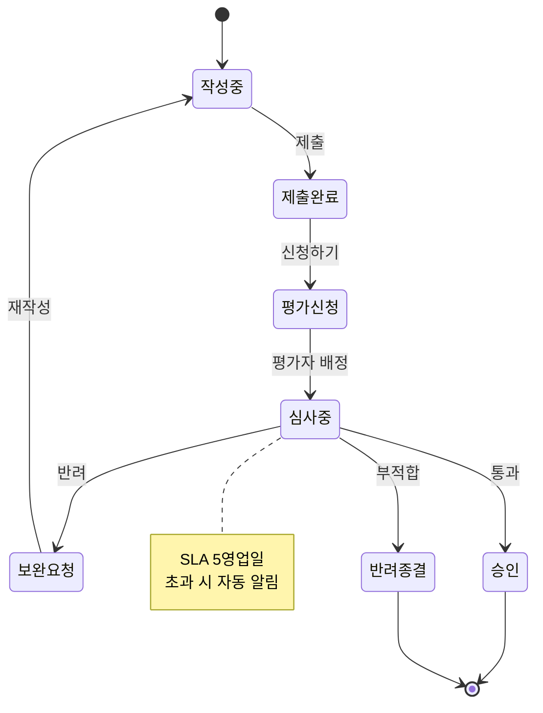
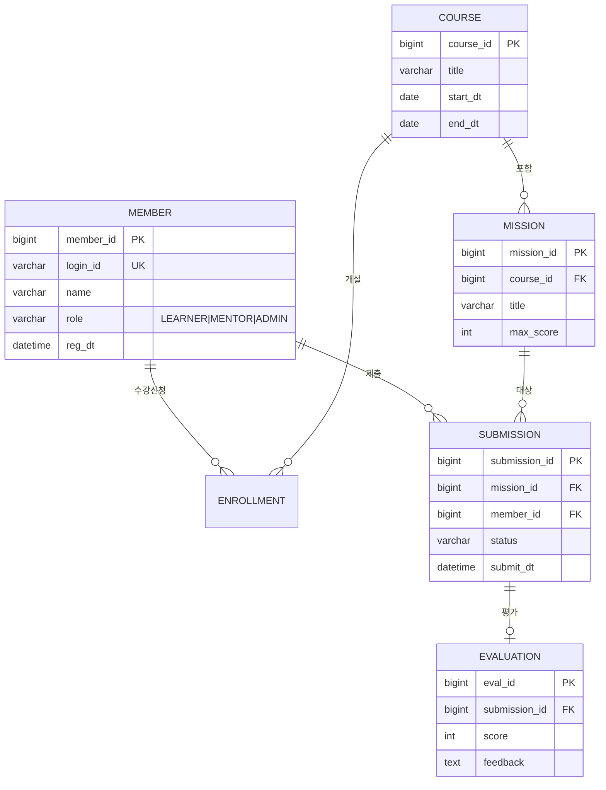
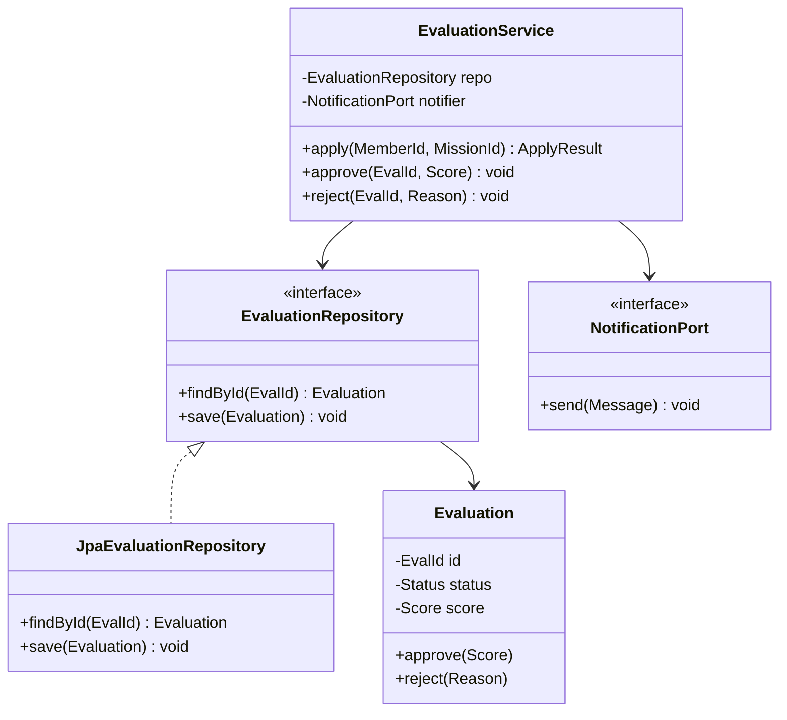
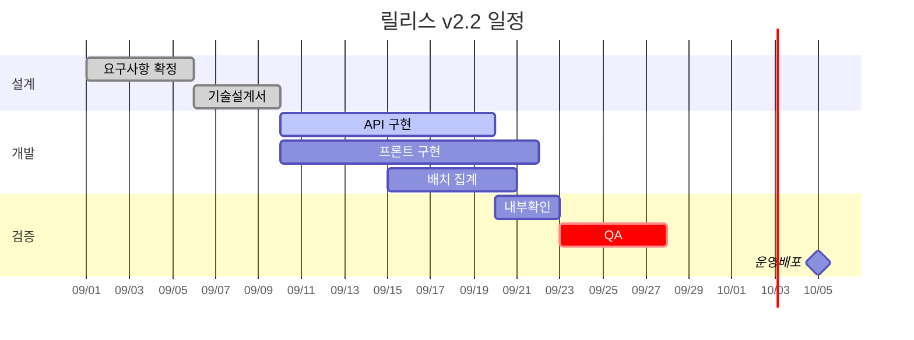
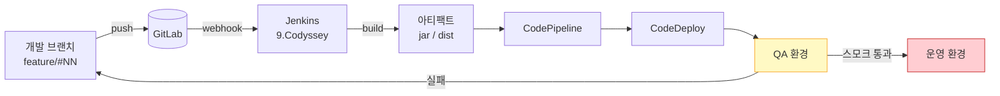
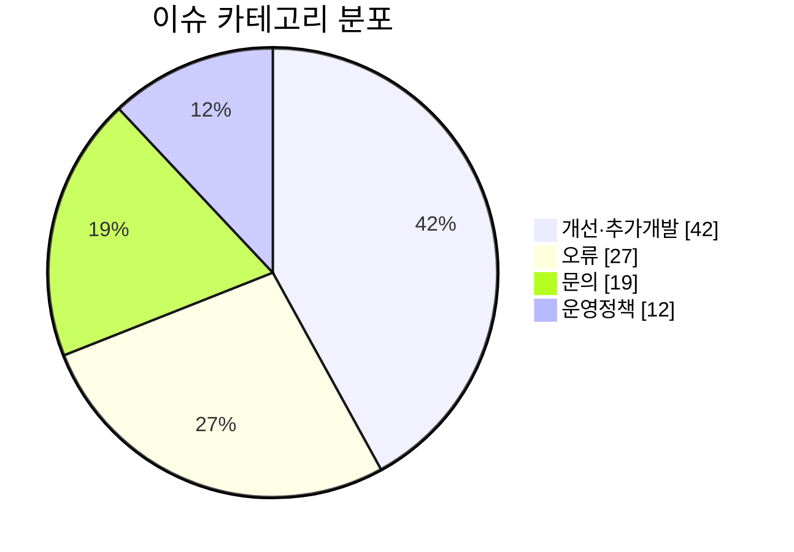
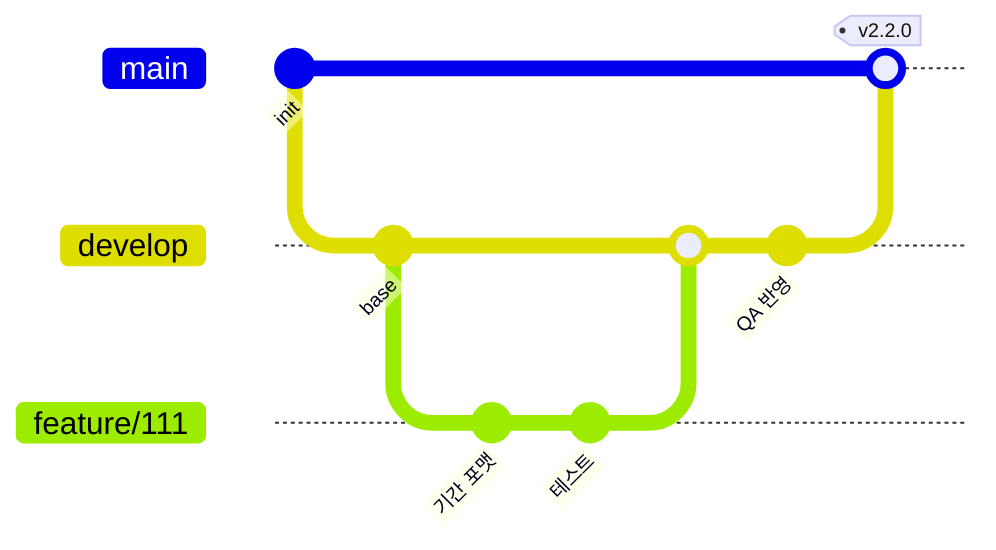

# 마크다운 표현 종합 샘플

> 이 문서는 **도표·수식·아키텍처 다이어그램**을 포함한 마크다운 문법 샘플이다.
> 렌더러(GitHub / VS Code / Obsidian / Typora)에 따라 지원 범위가 다르므로, 각 절 끝에 호환성을 표기했다.

---

## 1. 문서 구조 기본

### 1.1 텍스트 강조

일반 텍스트, *기울임*, **굵게**, ***굵은 기울임***, ~~취소선~~, `인라인 코드`, <mark>하이라이트</mark>, H~2~O 아래첨자, X^2^ 위첨자.

- 순서 없는 목록
  - 2단계 중첩
    - 3단계 중첩
1. 순서 있는 목록
2. 두 번째
   1. 중첩 번호

- [x] 완료된 작업
- [ ] 미완료 작업
- [ ] ~~취소된 작업~~

용어 정의(Definition List):

용어
: 정의 내용을 여기에 쓴다.

아키텍처
: 시스템의 구성 요소와 그 관계를 규정한 구조.

각주 사용 예시[^1]와 두 번째 각주[^note].

[^1]: 각주 본문은 문서 하단에 렌더링된다.
[^note]: 이름 있는 각주도 가능하다.

> 인용문 1단계
>> 인용문 2단계
>
> — 출처 표기

---

## 2. 도표 (Table)

### 2.1 정렬·병합 없는 기본 표

| 구분 | 서비스 | 언어/런타임 | 포트 | 비고 |
|:---|:---|:---:|---:|---|
| 프론트엔드 | web-usr | Node 24 / Vite | 3000 | 학습자 포털 |
| 프론트엔드 | web-adm | Next.js | 3001 | 운영자 콘솔 |
| 백엔드 | api-core | Java 1.8 / Gradle | 8080 | 도메인 API |
| 백엔드 | api-batch | Java 1.8 / Gradle | 8081 | 야간 집계 |
| 저장소 | MariaDB | 10.x | 3306 | `inno_prd_codyc` |

정렬 지정: `:---`(좌), `:---:`(중앙), `---:`(우).

### 2.2 셀 안에 코드·수식·줄바꿈

| 항목 | 표현식 | 설명 |
|---|---|---|
| 응답시간 SLO | `p95 < 300ms` | 5분 이동 윈도우<br>초과 시 경보 |
| 가용성 | $A = \dfrac{MTBF}{MTBF + MTTR}$ | 월간 집계 |
| 에러버짓 | $1 - 0.999 = 0.1\%$ | 월 약 43분 |

> 셀 내 줄바꿈은 `<br>`, 파이프 문자는 `\|`로 이스케이프한다.

### 2.3 HTML 표 (셀 병합이 필요할 때)

<table>
  <thead>
    <tr><th rowspan="2">계층</th><th colspan="2">구성</th><th rowspan="2">SLO</th></tr>
    <tr><th>컴포넌트</th><th>인스턴스</th></tr>
  </thead>
  <tbody>
    <tr><td rowspan="2">Edge</td><td>CDN</td><td>-</td><td>99.99%</td></tr>
    <tr><td>ALB</td><td>2</td><td>99.95%</td></tr>
    <tr><td>App</td><td>API</td><td>4</td><td>99.9%</td></tr>
    <tr><td>Data</td><td>MariaDB</td><td>1 + 1(RR)</td><td>99.95%</td></tr>
  </tbody>
</table>

---

## 3. 수식 (LaTeX / KaTeX)

### 3.1 인라인 수식

전체 지연시간은 $T_{total} = T_{net} + T_{app} + T_{db}$ 로 분해되며, 캐시 적중률이 $h$ 일 때 유효 비용은 $C_{eff} = h\,C_{cache} + (1-h)\,C_{origin}$ 이다.

### 3.2 블록 수식

$$
\text{Throughput} = \frac{N_{concurrency}}{T_{latency}}
\qquad\text{(Little's Law)}
$$

$$
P(\text{요청 대기}) = \frac{\rho^{c}}{c!\,(1-\rho)}\Bigg/\left[\sum_{k=0}^{c-1}\frac{\rho^{k}}{k!} + \frac{\rho^{c}}{c!\,(1-\rho)}\right],
\quad \rho = \frac{\lambda}{c\mu}
$$

### 3.3 행렬·집합·케이스

$$
W =
\begin{bmatrix}
w_{11} & w_{12} & \cdots & w_{1n} \\
w_{21} & w_{22} & \cdots & w_{2n} \\
\vdots & \vdots & \ddots & \vdots \\
w_{m1} & w_{m2} & \cdots & w_{mn}
\end{bmatrix}
\in \mathbb{R}^{m \times n}
$$

$$
\text{grade}(s) =
\begin{cases}
A, & s \ge 90 \\
B, & 80 \le s < 90 \\
C, & 70 \le s < 80 \\
F, & \text{otherwise}
\end{cases}
$$

### 3.4 합·적분·극한

$$
\overline{x} = \frac{1}{n}\sum_{i=1}^{n} x_i,
\qquad
\sigma = \sqrt{\frac{1}{n}\sum_{i=1}^{n}(x_i - \overline{x})^2}
$$

$$
\mathcal{L} = -\sum_{i=1}^{C} y_i \log \hat{y}_i,
\qquad
\hat{y}_i = \frac{e^{z_i}}{\sum_{j=1}^{C} e^{z_j}}
$$

$$
\lim_{n \to \infty}\left(1 + \frac{1}{n}\right)^{n} = e
\qquad
\int_{0}^{\infty} e^{-x^2}\,dx = \frac{\sqrt{\pi}}{2}
$$

### 3.5 화학식·단위

$$
\ce{CO2 + H2O -> H2CO3}
$$

> `\ce{}`는 mhchem 확장이 켜진 렌더러에서만 동작한다.

**호환성**: GitHub은 `$...$` / `$$...$$` 를 지원한다(2022년 이후). Obsidian·Typora·VS Code(Markdown+Math)도 지원. 일부 사내 위키는 미지원이므로 이미지로 대체 필요.

---

## 4. 아키텍처 다이어그램 (Mermaid)

### 4.1 시스템 구성도 — flowchart



### 4.2 요청 흐름 — sequenceDiagram



### 4.3 상태 전이 — stateDiagram



### 4.4 데이터 모델 — erDiagram



### 4.5 클래스 구조 — classDiagram



### 4.6 일정 — gantt



### 4.7 배포 파이프라인 — flowchart LR



### 4.8 비중 — pie



### 4.9 브랜치 전략 — gitGraph



**호환성**: GitHub·GitLab·Obsidian·VS Code(Markdown Preview Mermaid)에서 렌더링된다. Confluence·한글/워드 변환 시에는 PNG/SVG로 내보내야 한다.

---

## 5. ASCII 아키텍처 다이어그램 (렌더러 무관)

Mermaid를 지원하지 않는 환경을 위한 대체 표현이다.

```text
                        ┌──────────────────────────┐
     사용자 ───────────▶│      CloudFront (CDN)    │
                        └────────────┬─────────────┘
                                     │ HTTPS
                        ┌────────────▼─────────────┐
                        │   ALB  (TLS 종단/라우팅)  │
                        └───┬──────────────────┬───┘
                            │                  │
                ┌───────────▼──────┐  ┌────────▼─────────┐
                │   api-core  x4   │  │  auth-service x2 │
                │  Spring Boot 8   │  │    JWT 발급      │
                └───┬──────────┬───┘  └────────┬─────────┘
                    │          │               │
        ┌───────────▼──┐  ┌────▼──────┐  ┌─────▼──────┐
        │   MariaDB    │  │   Redis   │  │     S3     │
        │ inno_prd_... │  │ 세션/캐시 │  │  산출물     │
        └──────┬───────┘  └───────────┘  └────────────┘
               │ 비동기 복제
        ┌──────▼───────┐
        │ Read Replica │
        └──────────────┘
```

레이어별 책임:

```text
┌─────────────────────────────────────────────────┐
│ Presentation   컨트롤러 · DTO · 검증             │
├─────────────────────────────────────────────────┤
│ Application    유스케이스 · 트랜잭션 경계        │
├─────────────────────────────────────────────────┤
│ Domain         엔티티 · 값객체 · 도메인 서비스   │  ← 프레임워크 의존 금지
├─────────────────────────────────────────────────┤
│ Infrastructure JPA · 외부 API · 메시징            │
└─────────────────────────────────────────────────┘
                   의존 방향: 위 → 아래 (단방향)
```

---

## 6. 코드 블록

### 6.1 언어별 하이라이팅

```java
@Service
@RequiredArgsConstructor
public class EvaluationService {

    private final EvaluationRepository repository;

    @Transactional
    public ApplyResult apply(MemberId memberId, MissionId missionId) {
        Evaluation eval = Evaluation.newApplication(memberId, missionId);
        repository.save(eval);
        return ApplyResult.of(eval.getId());
    }
}
```

```typescript
interface EvaluationSummary {
  id: number;
  status: 'DRAFT' | 'APPLIED' | 'REVIEWING' | 'APPROVED' | 'REJECTED';
  score?: number;
}

export async function fetchSummary(id: number): Promise<EvaluationSummary> {
  const res = await fetch(`/api/v1/eval/${id}`);
  if (!res.ok) throw new Error(`HTTP ${res.status}`);
  return res.json();
}
```

```sql
SELECT m.name,
       COUNT(s.submission_id)            AS submit_cnt,
       ROUND(AVG(e.score), 1)            AS avg_score
  FROM MEMBER m
  LEFT JOIN SUBMISSION s ON s.member_id = m.member_id
  LEFT JOIN EVALUATION e ON e.submission_id = s.submission_id
 WHERE m.role = 'LEARNER'
   AND s.submit_dt >= '2026-09-01'
 GROUP BY m.member_id
HAVING submit_cnt > 0
 ORDER BY avg_score DESC
 LIMIT 20;
```

```bash
#!/usr/bin/env bash
set -euo pipefail

BRANCH="${1:-main}"
make switch "$BRANCH"
make dev BRANCH="$BRANCH" SKIP_BUILD=0
make status
```

```yaml
services:
  api-core:
    image: codyssey/api-core:2.2.0
    ports: ["8080:8080"]
    environment:
      SPRING_PROFILES_ACTIVE: dev
      DB_URL: jdbc:mariadb://db:3306/inno_prd_codyc
    depends_on: [db, redis]
    healthcheck:
      test: ["CMD", "curl", "-f", "http://localhost:8080/actuator/health"]
      interval: 10s
      retries: 5
```

```diff
- const timeout = 3000;
+ const timeout = 10_000; // 배치 집계 응답 지연 대응 (#111)
  const res = await fetch(url, { signal: AbortSignal.timeout(timeout) });
```

### 6.2 들여쓰기 코드 블록

    # 4칸 들여쓰기도 코드 블록이 된다
    echo "no language highlighting"

---

## 7. 링크 · 이미지 · 기타

- 인라인 링크: [Mermaid 공식 문서](https://mermaid.js.org/)
- 참조 링크: [KaTeX 지원 함수][katex]
- 앵커 링크: [4장으로 이동](#4-아키텍처-다이어그램-mermaid)
- 자동 링크: <https://github.com>

[katex]: https://katex.org/docs/supported.html "KaTeX Supported Functions"

이미지(크기 지정은 HTML 사용):


접기/펼치기:

<details>
<summary><b>부록 A — 환경변수 전체 목록 (클릭하여 펼치기)</b></summary>

| 변수 | 기본값 | 설명 |
|---|---|---|
| `DB_URL` | - | JDBC 접속 문자열 |
| `REDIS_HOST` | `localhost` | 세션 저장소 |
| `JWT_TTL` | `3600` | 액세스 토큰 수명(초) |
| `LOG_LEVEL` | `INFO` | 로그 레벨 |

</details>

키보드 표기: <kbd>Ctrl</kbd> + <kbd>Shift</kbd> + <kbd>P</kbd>

수평선:

---

경고/알림 (GitHub Alerts):

> [!NOTE]
> 참고: 이 문법은 GitHub에서만 전용 스타일로 렌더링된다.

> [!TIP]
> 팁: 다이어그램은 소스(Mermaid)로 관리하면 diff가 남는다.

> [!IMPORTANT]
> 중요: 운영 DB 접속은 읽기 전용 계정만 사용한다.

> [!WARNING]
> 경고: 배포 전 스모크 테스트를 건너뛰지 않는다.

> [!CAUTION]
> 주의: `DROP` 구문이 포함된 마이그레이션은 사전 승인 필요.

---

## 8. 렌더러 호환성 요약

| 기능 | GitHub | GitLab | VS Code | Obsidian | Typora |
|---|:---:|:---:|:---:|:---:|:---:|
| 표 | O | O | O | O | O |
| 수식 `$$` | O | O | 확장 필요 | O | O |
| Mermaid | O | O | 확장 필요 | O | O |
| GitHub Alerts | O | X | X | 일부 | X |
| 각주 | O | O | 확장 필요 | O | O |
| 정의 목록 | X | X | 확장 필요 | 일부 | O |
| 위/아래첨자 `^ ~` | X | X | 확장 필요 | 일부 | O |
| `<details>` 접기 | O | O | O | O | O |

---

*문서 끝 — 작성일 2026-09-11*
