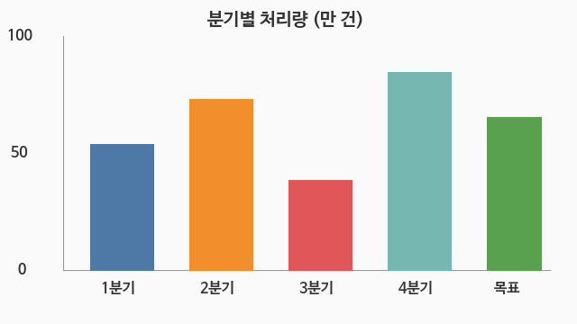
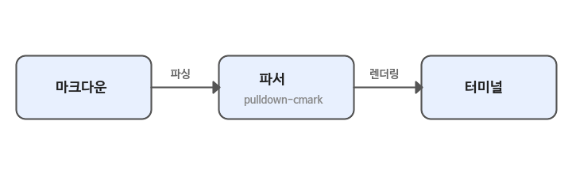
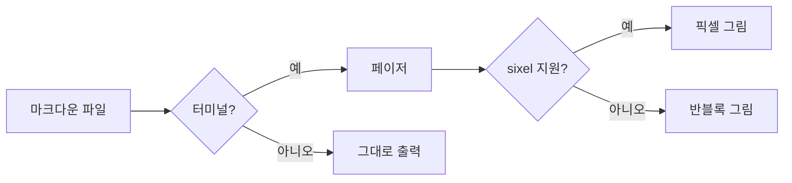
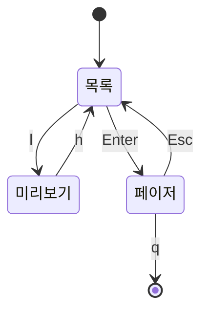
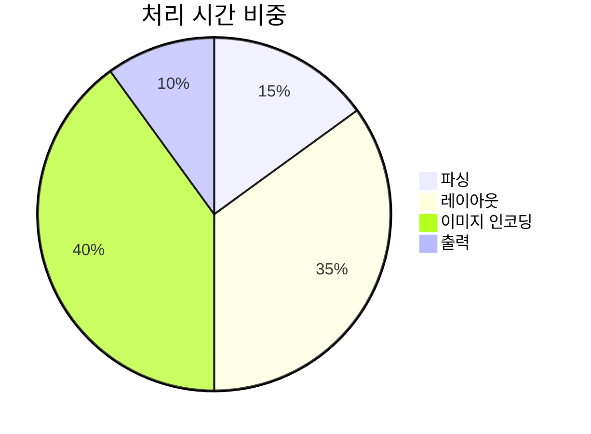

# mdview 쇼케이스

<p align="center"></p>

그림, 수식, 다이어그램, 표를 한 문서에 모았습니다. 사용하는 이미지는 모두 `images/` 폴더에 있어서
인터넷 없이도 보입니다.

- sixel 터미널(SIXEL 패치를 넣은 st, xterm, foot 등): 페이저와 파일 브라우저 미리보기에서 그림이 원본 해상도로 보입니다.
- 그 밖의 터미널과 `mdview -P` 출력: 반블록 문자(`▀`)로 그립니다.

```sh
mdview examples/showcase.md       # 페이저로 보기
mdview examples/                  # 파일 브라우저에서 미리보기
```

---

## 1. 그림

### 1.1 사진 (JPEG)

문단에 이미지 하나만 있으면 그림으로 그리고, 아래에 대체 글과 경로를 남깁니다.


### 1.2 차트 (PNG)



분기별 처리량은 4분기에 가장 많았고, 목표치($65$만 건)를 넘긴 분기는 2분기와 4분기입니다.

### 1.3 구성도 (HTML ``)

이미지만 담은 HTML 블록도 그림으로 그립니다. README에서 가운데 정렬할 때 흔히 쓰는 형태입니다.

<p align="center">
  
</p>

### 1.4 문서에 박힌 그림 (base64)

이미지 파일 없이 `data:image/png;base64,...` 로 문서 안에 그림을 직접 넣을 수 있습니다.
경로가 필요 없어 이 문서만 따로 옮겨도 보입니다.

![base64로 박힌 배지](data:image/png;base64,iVBORw0KGgoAAAANSUhEUgAAAPAAAABaCAMAAACxDCsoAAAAP1BMVEX///8tMzs3NztaRjyZYj3UfD7wiD6prbP8/PxJT1c0OkOIkJjT1NZ7g4yVn6o7QkpUW2RobnZeZW6tucZzfIcdSLH/AAAAAXRSTlMAQObYZgAABP5JREFUeNrtnOmCqyAMhYfbhU2Qxfd/1psEbW2lU60jttXzZ9RufOQkoDL+/NyIfaF+Hunf2i1bTv8yuGu3aWltjfeeeO3WlCZeuy2lidduSWnitdtRmnjtVhQnXrsRpYG/eL4x1L+NBZhCvHYTduCFgdduQXHitRuwA+/AO/AOvAjw4Xg8nc/n0/F4WLvNywMfjudbfTD0CODD6TzU6VORnwJncT8Y+Rnw8fxYx7Ub//fAh/PvehhkLoRcG+0F4Ge8j4mnAytdCVHx7lMK9kxp4Oe8D4knA0sARNl234rywGN4HxFPBa6B1zrnuU77TpQHHsf7gHgqMLzf9fcrwYsDj+Q9nx8BYFKmnJQWDctr1qWqVnjYcTyKoLUQvv9xLapQGvg4Gjg3OgFKm5RA7NOWqFItajeBKsnTpuSXjkBDy9LAYw39wNQYu8qHKESkAsQNRtYzgyENcIC6ofLSU59w0esINLRmpYFPE4BP+QgrajrgWI6bAUuwTd6VHF+q0ONArBk53psKt8nQrDTwlADnQsxT09GrniGucrDJKaypOjlMcJBDE2C2M0plCL2kPCgMPCXAuRB3VZfiB9UpOZbiik5m1wwmH4u2qFNxr6ivygLXk3gzIe6GpYDAyFZFTsDKEqK8B07JCweDTttlgceX6KRBoe6AMcKBABlLtmU18SvdH4mqFhh6I1Si3xWFgCfyDsdiAA4dQQsvW+A0NvlwnUbS21X7t/5YYKRT0GjVAlNhomkGOldf8lbxgEawqU8q5gIJusoGx/5cWeBpNTqXxDSH8k3VDkVVo2nkQVsbb4gVna29t+QFmkp70bO5L5nDU1N4mMSXmRaMxrK1JwJ3fsV42s64sj1ZEO1Y9qHA17mihFEJtip0eRO7cQkKMW1bnH7Qe0QM128oCjxtFEadpv7uasoCT+bNnzK9pXbgTQJvLofnV+n31Q6Mmj/Tel8tNJd+X+3ApNnnw++rPPDUJK7H/ZiOl6vzLgYdVf9FFxv8wyOoZnW0v3yR+vXVF4BnX9NiNrZKiDxegKWNVvaADR7UsW6BPUpdgWUDMqZpPIODMXXH3wPPvWoJwAZbaofANurIs8BwduR1UnMBdl3PwZmjwq/kiwDPvS4NWOqCCIq825PQ8ia6PnAKm4vWwLEke7W0IjkCxujbZYBn3nm4s7SEBtbGYLxD9BA1H3rAhigwlBBjFXyoh1lK8VfLWXruvSXmm1ZUzzy0UiZ8D8C0mc9hySOULTdACvgqHMRosycl7TXgWXcPVV8p3gYO6guw1RlLIzC+RXE7QPJ4NURFjhVMc7ME8Jz7wzz2hJBGQ9SIJlm6ueawIyMY1QE7JTPABj9PlubWGrcE8JwVAMnQMSZTy8hrxQE2W7Q6P9QS3V9j8nM5ALbx5ga7e3nJzEJrPJiUXWnGgUVScrrrsKR6wKGzQrpoJ4PLZGka17qyFReJ8JxVPIB1BU5X36XJTzyYhLEGTZ0mHgxnGHgPiq7Y1l3tQ7eQqa1BLQT8+jotAq7vZ5xjppa35Vn2iwGOxMkGSwxLrV5diQczraTepeaRwLz9JB29K/dASiVuOeBX11raXlgmAndSma9dOId/Qf7QpaUj10vXg/XSI88H31D7ivhv1w787dqBv11b+/fSDf7/8PaAN/fQg02FeJPP8dgS8dYexrO1xy1t7YFaW3tk2tYeirc/5vF743xL+B/1tMLccnbRzgAAAABJRU5ErkJggg==)

HTML `` 에서도 같은 방식으로 씁니다.

<p align="center"></p>

### 1.5 그림으로 그리지 않는 경우

- 문장 속 이미지는 글자로 남습니다: 로고  가 문장 한가운데 있는 경우.
- 파일이 없으면 대체 글만 보입니다.


---

## 2. 수식

### 2.1 인라인 수식

원의 넓이는 $A = \pi r^2$ 이고, 피타고라스 정리는 $a^2 + b^2 = c^2$ 입니다.
이차방정식 $ax^2 + bx + c = 0$ 의 근은 아래 블록 수식으로 적습니다.

### 2.2 블록 수식

$$
x = \frac{-b \pm \sqrt{b^2 - 4ac}}{2a}
$$

$$
e^{i\pi} + 1 = 0
$$

$$
f(x) = \sum_{n=0}^{\infty} \frac{f^{(n)}(a)}{n!}\,(x - a)^n
$$

$$
\int_{-\infty}^{\infty} e^{-x^2}\,dx = \sqrt{\pi}
\qquad
\lim_{h \to 0} \frac{f(x+h) - f(x)}{h} = f'(x)
$$

### 2.3 행렬과 경우 나누기

$$
R(\theta) =
\begin{bmatrix}
\cos\theta & -\sin\theta \\
\sin\theta & \cos\theta
\end{bmatrix}
$$

$$
|x| =
\begin{cases}
x, & x \ge 0 \\
-x, & x < 0
\end{cases}
$$

### 2.4 통계

$$
\overline{x} = \frac{1}{n}\sum_{i=1}^{n} x_i,
\qquad
\sigma^2 = \frac{1}{n}\sum_{i=1}^{n}(x_i - \overline{x})^2
$$

---

## 3. 다이어그램 (Mermaid)

### 3.1 흐름도



### 3.2 순서도

```mermaid
sequenceDiagram
    participant U as 사용자
    participant M as mdview
    participant T as 터미널
    U->>M: 문서 열기
    M->>T: DA1 질의
    T-->>M: ESC[?62;4c
    M->>T: 본문 그리기
    M->>T: sixel 이미지
    U->>M: 스크롤
    M->>T: 화면 지우고 다시 그리기
```

### 3.3 상태도



### 3.4 파이 차트



---

## 4. 표

| 기능 | sixel 터미널 | 그 밖의 터미널 | `-P` 출력 |
|:-----|:-----------:|:-------------:|:--------:|
| 그림 | 원본 해상도 | 반블록 | 반블록 |
| 수식 | 문자 조판 | 문자 조판 | 문자 조판 |
| 다이어그램 | 박스 문자 | 박스 문자 | 박스 문자 |
| 구문 강조 | 트루컬러 | 트루컬러 | 트루컬러 |

<table>
  <tr><th rowspan="2">구분</th><th colspan="2">크기</th></tr>
  <tr><th>가로</th><th>세로</th></tr>
  <tr><td>landscape.jpg</td><td>800</td><td>450</td></tr>
  <tr><td>chart.png</td><td>640</td><td>360</td></tr>
  <tr><td>pipeline.png</td><td>720</td><td>220</td></tr>
</table>

---

## 5. 코드

```rust
/// 원본보다 키우지 않고 상자 안에 비율을 지켜 넣는다.
fn fit(w: u32, h: u32, max_w: u32, max_h: u32) -> (u32, u32) {
    let s = (max_w as f64 / w as f64).min(max_h as f64 / h as f64).min(1.0);
    ((w as f64 * s) as u32, (h as f64 * s) as u32)
}
```

> **참고**: 이미지 경로는 이 문서가 있는 폴더를 기준으로 찾습니다. 다른 곳으로 옮길 때는
> `images/` 폴더도 함께 옮기세요.[^1]

[^1]: 원격 문서(`mdview https://...`)라면 문서 URL을 기준으로 이미지를 내려받습니다.
